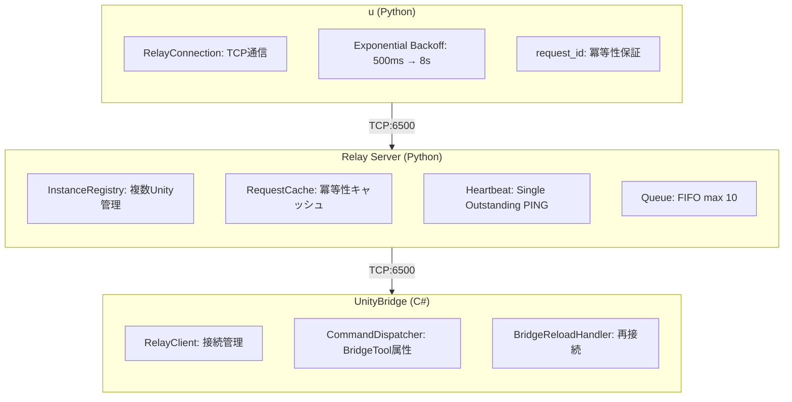

# Unity CLI

[](https://github.com/bigdra50/unity-cli/actions/workflows/ci.yml)
[](https://www.python.org/)
[](https://opensource.org/licenses/MIT)
[](https://unity.com/)
[](https://deepwiki.com/bigdra50/unity-cli)

[English](README.md)

コマンドラインから Unity Editor を操作する CLI ツール。

## 概要

Play Mode 制御、コンソールログ取得、テスト実行、シーン/GameObject 操作など、Unity Editor の主要機能を CLI から実行できます。

```bash
# Play Mode 制御
u play
u stop

# コンソールログ取得（エラー以上）
u console get -l E

# メニュー実行
u menu exec "Assets/Refresh"

# ContextMenu 実行
u menu context "DoSomething" -t "/Player"
```

主な特徴:
- Unity Editor の主要操作を CLI で実行
- MenuItem / ContextMenu の実行に対応
- 複数 Unity インスタンスの同時制御
- ドメインリロード耐性（自動再接続）
- UI Toolkit VisualElementツリーの検査（dump, query, inspect + ref ID方式）
- プロジェクトを適切なバージョンで開く（Unity Hub連携）
- プロジェクト情報取得（Relay Server不要）

## 動作要件

- [uv](https://docs.astral.sh/uv/) (Python パッケージマネージャー)
- Python 3.11+
- Unity 2021.3+
- Unity Hub（`open`/`editor`コマンド使用時）

## クイックスタート

### 1. Unity側セットアップ

UnityプロジェクトにUnityBridgeパッケージを追加:

```
Window > Package Manager > + > Add package from git URL...
https://github.com/bigdra50/unity-cli.git?path=UnityBridge
```

### 2. 接続

Unity Editorで `Window > Unity Bridge` を開き:
1. Start Server をクリック（Relay Server起動）
2. Connect をクリック（Unity → Relay接続）

ツールバー右側のインジケータで接続状態を確認でき、クリックで接続/切断をトグルできます。

### 3. CLIで操作

```bash
# uvx で直接実行（インストール不要）
uvx --from git+https://github.com/bigdra50/unity-cli u state

# Play Mode制御
uvx --from git+https://github.com/bigdra50/unity-cli u play
uvx --from git+https://github.com/bigdra50/unity-cli u stop

# コンソールログ取得（エラー以上）
uvx --from git+https://github.com/bigdra50/unity-cli u console get -l E
```

## インストール

```bash
# グローバルインストール
uv tool install git+https://github.com/bigdra50/unity-cli

# インタラクティブUI付き（エディタ選択プロンプト）
uv tool install "git+https://github.com/bigdra50/unity-cli[interactive]"

# CLIコマンド（すべてのエイリアスが同じ動作）
unity-cli state    # フルネーム
unity state        # 短縮形
u state            # 最短形

u play
u console get -l E -c 10       # 最新10件のエラー以上

# Relay Server 単体起動
unity-relay --port 6500
```

## CLI コマンド

### バージョン

```bash
u version                     # CLIバージョンを表示
```

### シェル補完

```bash
# Zsh
u completion -s zsh > ~/.zsh/completions/_unity-cli

# Bash
u completion -s bash >> ~/.bashrc

# Fish
u completion -s fish > ~/.config/fish/completions/unity-cli.fish
```

### プロジェクトを開く

```bash
# プロジェクトを適切なバージョンで開く（ProjectVersion.txt参照）
u open ./MyUnityProject

# エディタバージョンを指定
u open ./MyUnityProject --editor 2022.3.10f1

# 非インタラクティブモード（CI/スクリプト向け）
u open ./MyUnityProject --non-interactive

# 終了まで待機
u open ./MyUnityProject --wait
```

### エディタ管理

```bash
# インストール済みエディタ一覧
u editor list

# エディタインストール
u editor install 2022.3.10f1

# モジュール付きでインストール
u editor install 2022.3.10f1 --modules android ios webgl
```

### プロジェクト情報（Relay Server不要）

```bash
# プロジェクト全情報
u project info ./MyUnityProject

# Unityバージョンのみ
u project version ./MyUnityProject

# パッケージ一覧
u project packages ./MyUnityProject

# タグ・レイヤー
u project tags ./MyUnityProject

# 品質設定
u project quality ./MyUnityProject

# Assembly Definition一覧
u project assemblies ./MyUnityProject

# JSON出力
u --json project info ./MyUnityProject
```

### 基本操作（Relay Server経由）

```bash
# エディタ状態確認
u state

# Play Mode制御
u play
u stop
u pause

# コンソールログ
u console get                  # 全件
u console get -l W             # warning以上（warning, error, exception）
u console get -l E             # error以上（error, exception）
u console get -l +W            # warningのみ
u console get -l +E+X          # errorとexceptionのみ
u console get -c 20            # 最新20件
u console get -f "error"       # テキストでフィルタ
u console clear                # コンソールクリア

# アセットリフレッシュ
u refresh

# エディタ選択状態
u selection

# スクリーンショット
u screenshot                           # GameView（デフォルト）
u screenshot -s scene                  # SceneView
u screenshot -s camera                 # Camera.Render
u screenshot -p ./output.png           # 出力パス指定
u screenshot -s camera -c "Main Camera" -W 1920 -H 1080
```

### インスタンス管理

```bash
# 接続中インスタンス一覧
u instances

# 特定インスタンスを指定
u --instance /Users/dev/MyGame state
u --instance /Users/dev/Demo play
```

### テスト実行

```bash
# EditModeテスト
u tests run edit

# PlayModeテスト
u tests run play

# フィルタリング
u tests run edit --test-names "MyTests.SampleTest"
u tests run edit --categories "Unit" "Integration"
u tests run edit --assemblies "MyGame.Tests"

# テスト一覧
u tests list edit
u tests list play

# 実行中テストのステータス確認
u tests status
```

### シーン操作

```bash
# アクティブシーン情報
u scene active

# 階層取得
u scene hierarchy                    # ルートのみ（depth 1）
u scene hierarchy --depth 2          # 2階層まで
u scene hierarchy --page-size 100    # ページサイズ指定

# シーン操作
u scene load --name MainScene
u scene save
```

### GameObject操作

```bash
# 検索
u gameobject find "Main Camera"
u gameobject find "Player" --iterate-all

# 作成
u gameobject create --name "MyCube" --primitive Cube --position 0 1 0

# 変更
u gameobject modify --name "MyCube" --position 5 0 0 --rotation 0 45 0

# 削除
u gameobject delete --name "MyCube"
```

### コンポーネント操作

```bash
# コンポーネント一覧
u component list -t "Main Camera"

# コンポーネント詳細
u component inspect -t "Main Camera" -T Camera

# コンポーネント追加
u component add -t "Player" -T Rigidbody

# コンポーネント削除
u component remove -t "Player" -T Rigidbody
```

### メニュー/ContextMenu

```bash
# メニュー実行
u menu exec "Edit/Play"
u menu exec "Assets/Refresh"
u menu exec "Window/General/Console"

# メニュー一覧
u menu list                    # 全メニュー
u menu list -f "Assets"        # フィルタリング
u menu list -f "Play" -l 20    # 件数制限

# ContextMenu実行（シーン内オブジェクト）
u menu context "Reset" -t "/Player"

# ContextMenu実行（ScriptableObject）
u menu context "DoSomething" -t "Assets/Data/Config.asset"

# ContextMenu実行（Prefab）
u menu context "Initialize" -t "Assets/Prefabs/Enemy.prefab"
```

### アセット操作

```bash
# Prefab作成
u asset prefab -s "Player" -p "Assets/Prefabs/Player.prefab"

# ScriptableObject作成
u asset scriptable-object -T "GameConfig" -p "Assets/Data/Config.asset"

# アセット情報
u asset info "Assets/Data/Config.asset"
```

### UI Toolkit ツリー検査

EditorパネルとRuntimeパネルのUI Toolkit VisualElementツリーを検査する。Playwright MCP風のref ID方式で、ツリーをダンプしてからref IDで個別要素を詳細取得するフローが可能。

```bash
# パネル一覧（Editor + Runtime）
u uitree dump

# 指定パネルのVisualElementツリーをダンプ
u uitree dump -p "Toolbar"

# 深度制限
u uitree dump -p "Toolbar" -d 3

# JSON出力
u uitree dump -p "Toolbar" -o json

# type/name/USSクラスで検索（AND条件）
u uitree query -p "PanelSettings" -t Button
u uitree query -p "PanelSettings" -n "StartBtn"
u uitree query -p "PanelSettings" -c "primary-button"

# ref IDで要素詳細を取得（dump/query時に割り当て）
u uitree inspect ref_3

# resolvedStyle（レイアウト、色、フォント、マージン等）を含める
u uitree inspect ref_3 --style

# 直接の子要素情報を含める
u uitree inspect ref_3 --children

# パネル + 名前で指定（事前のdump不要）
u uitree inspect -p "Toolbar" -n "Play"
```

### 設定

```bash
# 現在の設定を表示
u config show

# デフォルト .unity-cli.toml を生成
u config init
u config init -o ./custom-config.toml
u config init --force                  # 既存を上書き
```

## オプション

### 共通オプション

| オプション | 説明 | デフォルト |
|-----------|------|-----------|
| `--relay-host` | Relay Serverホスト | 127.0.0.1 |
| `--relay-port` | Relay Serverポート | 6500 |
| `--instance`, `-i` | 対象Unityインスタンス | デフォルト |
| `--timeout`, `-t` | タイムアウト（秒） | 10.0 |
| `--json`, `-j` | JSON形式で出力 | false |

### tests専用オプション

| オプション | 説明 |
|-----------|------|
| `--test-names`, `-n` | テスト名（完全一致） |
| `--group-pattern`, `-g` | テスト名の正規表現パターン |
| `--categories`, `-c` | NUnitカテゴリ |
| `--assemblies`, `-a` | アセンブリ名 |
| `--sync`, `-s` | 同期実行（EditModeのみ） |

### scene hierarchy オプション

| オプション | 説明 | デフォルト |
|-----------|------|-----------|
| `--depth`, `-d` | 階層の深さ | 1（ルートのみ） |
| `--page-size` | ページサイズ | 50 |
| `--cursor` | ページネーションカーソル | 0 |

## アーキテクチャ



## プロトコル仕様

詳細は [docs/protocol-spec.md](docs/protocol-spec.md) を参照。

- Framing: 4-byte big-endian length + JSON
- State Machine: DISCONNECTED → READY → BUSY → RELOADING
- Heartbeat: 5秒間隔、15秒タイムアウト（3回リトライ）
- Retry: Exponential Backoff（500ms → 8s、最大30秒）

## トラブルシューティング

```bash
# Relay Serverが起動しているか確認
lsof -i :6500

# 接続中インスタンス確認
u instances

# Unityコンソールでエラー確認
u console get -l E
```

## v2.x → v3.0 マイグレーション

| 変更点 | v2.x | v3.0 |
|--------|------|------|
| コマンド名 | `unity-mcp` | `unity-cli` |
| 接続先 | Unity直接 (6400) | Relay Server (6500) |
| プロトコル | 8-byte framing | 4-byte framing |
| 複数インスタンス | 非対応 | 対応 |

```bash
# v2.x
unity-mcp --port 6400 state

# v3.0
u state  # Relay経由
u --instance /path/to/project state  # 特定インスタンス
```

## ライセンス

MIT License
