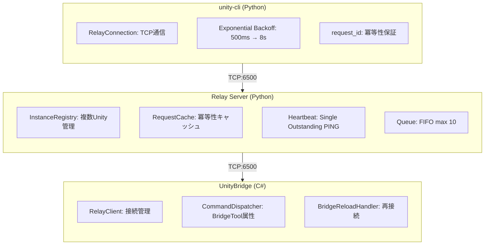

# Unity CLI

[](https://github.com/bigdra50/unity-cli/actions/workflows/ci.yml)
[](https://www.python.org/)
[](https://opensource.org/licenses/MIT)
[](https://unity.com/)

[English](README.md)

コマンドラインから Unity Editor を操作する CLI ツール。

## 概要

Play Mode 制御、コンソールログ取得、テスト実行、シーン/GameObject 操作など、Unity Editor の主要機能を CLI から実行できます。

```bash
# Play Mode 制御
unity-cli play
unity-cli stop

# コンソールログ取得
unity-cli console get --types error

# メニュー実行
unity-cli menu exec "Assets/Refresh"

# ContextMenu 実行
unity-cli menu context "DoSomething" -t "/Player"
```

主な特徴:
- Unity Editor の主要操作を CLI で実行
- MenuItem / ContextMenu の実行に対応
- 複数 Unity インスタンスの同時制御
- ドメインリロード耐性（自動再接続）
- プロジェクトを適切なバージョンで開く（Unity Hub連携）
- プロジェクト情報取得（Relay Server不要）

## 動作要件

- [uv](https://docs.astral.sh/uv/) (Python パッケージマネージャー)
- Python 3.11+
- Unity 2021.3+
- Unity Hub（`open`/`editor`コマンド使用時）

## クイックスタート

### 1. Unity側セットアップ

UnityプロジェクトにUnityBridgeパッケージを追加:

```
Window > Package Manager > + > Add package from git URL...
https://github.com/bigdra50/unity-cli.git?path=UnityBridge
```

### 2. 接続

Unity Editorで `Window > Unity Bridge` を開き:
1. Start Server をクリック（Relay Server起動）
2. Connect をクリック（Unity → Relay接続）

### 3. CLIで操作

```bash
# uvx で直接実行（インストール不要）
uvx --from git+https://github.com/bigdra50/unity-cli unity-cli state

# Play Mode制御
uvx --from git+https://github.com/bigdra50/unity-cli unity-cli play
uvx --from git+https://github.com/bigdra50/unity-cli unity-cli stop

# コンソールログ取得
uvx --from git+https://github.com/bigdra50/unity-cli unity-cli console --types error
```

## インストール

```bash
# グローバルインストール
uv tool install git+https://github.com/bigdra50/unity-cli

# インタラクティブUI付き（エディタ選択プロンプト）
uv tool install "git+https://github.com/bigdra50/unity-cli[interactive]"

# CLIコマンド
unity-cli state
unity-cli play
unity-cli console --types error --count 10

# Relay Server 単体起動
unity-relay --port 6500
```

## シェル補完

タブ補完を有効にする:

```bash
# Bash
unity-cli completion bash >> ~/.bashrc

# Zsh
unity-cli completion zsh >> ~/.zshrc

# Fish
unity-cli completion fish > ~/.config/fish/completions/unity-cli.fish

# PowerShell
unity-cli completion powershell >> $PROFILE
```

シェルを再起動するか、設定ファイルをsourceして有効化。

## CLI コマンド

### プロジェクトを開く

```bash
# プロジェクトを適切なバージョンで開く（ProjectVersion.txt参照）
unity-cli open ./MyUnityProject

# エディタバージョンを指定
unity-cli open ./MyUnityProject --editor 2022.3.10f1

# 非インタラクティブモード（CI/スクリプト向け）
unity-cli open ./MyUnityProject --non-interactive

# 終了まで待機
unity-cli open ./MyUnityProject --wait
```

### エディタ管理

```bash
# インストール済みエディタ一覧
unity-cli editor list

# エディタインストール
unity-cli editor install 2022.3.10f1

# モジュール付きでインストール
unity-cli editor install 2022.3.10f1 --modules android ios webgl
```

### プロジェクト情報（Relay Server不要）

```bash
# プロジェクト全情報
unity-cli project info ./MyUnityProject

# Unityバージョンのみ
unity-cli project version ./MyUnityProject

# パッケージ一覧
unity-cli project packages ./MyUnityProject

# タグ・レイヤー
unity-cli project tags ./MyUnityProject

# 品質設定
unity-cli project quality ./MyUnityProject

# Assembly Definition一覧
unity-cli project assemblies ./MyUnityProject

# JSON出力
unity-cli --json project info ./MyUnityProject
```

### 基本操作（Relay Server経由）

```bash
# エディタ状態確認
unity-cli state

# Play Mode制御
unity-cli play
unity-cli stop
unity-cli pause

# コンソールログ
unity-cli console
unity-cli console --types error warning --count 20

# アセットリフレッシュ
unity-cli refresh
```

### インスタンス管理

```bash
# 接続中インスタンス一覧
unity-cli instances

# 特定インスタンスを指定
unity-cli --instance /Users/dev/MyGame state
unity-cli --instance /Users/dev/Demo play

# デフォルトインスタンス変更
unity-cli set-default /Users/dev/MyGame
```

### テスト実行

```bash
# EditModeテスト
unity-cli tests edit

# PlayModeテスト
unity-cli tests play

# フィルタリング
unity-cli tests edit --test-names "MyTests.SampleTest"
unity-cli tests edit --category-names "Unit" "Integration"
unity-cli tests edit --assembly-names "MyGame.Tests"
```

### シーン操作

```bash
# アクティブシーン情報
unity-cli scene active

# 階層取得
unity-cli scene hierarchy                    # ルートのみ
unity-cli scene hierarchy --depth 2          # 2階層まで
unity-cli scene hierarchy --iterate-all      # 全階層（ページング）

# シーン操作
unity-cli scene load --name MainScene
unity-cli scene save
unity-cli scene create --name NewScene --path Assets/Scenes
```

### GameObject操作

```bash
# 検索
unity-cli gameobject find "Main Camera"
unity-cli gameobject find "Player" --iterate-all

# 作成
unity-cli gameobject create --name "MyCube" --primitive Cube --position 0,1,0

# 変更
unity-cli gameobject modify --name "MyCube" --position 5,0,0 --rotation 0,45,0

# 削除
unity-cli gameobject delete --name "MyCube"
```

### コンポーネント操作

```bash
# コンポーネント一覧
unity-cli component list -t "Main Camera"

# コンポーネント詳細
unity-cli component inspect -t "Main Camera" -T Camera

# コンポーネント追加
unity-cli component add -t "Player" -T Rigidbody

# コンポーネント削除
unity-cli component remove -t "Player" -T Rigidbody
```

### メニュー/ContextMenu

```bash
# メニュー実行
unity-cli menu exec "Edit/Play"
unity-cli menu exec "Assets/Refresh"
unity-cli menu exec "Window/General/Console"

# メニュー一覧
unity-cli menu list                    # 全メニュー
unity-cli menu list -f "Assets"        # フィルタリング
unity-cli menu list -f "Play" -l 20    # 件数制限

# ContextMenu実行（シーン内オブジェクト）
unity-cli menu context "Reset" -t "/Player"

# ContextMenu実行（ScriptableObject）
unity-cli menu context "DoSomething" -t "Assets/Data/Config.asset"

# ContextMenu実行（Prefab）
unity-cli menu context "Initialize" -t "Assets/Prefabs/Enemy.prefab"
```

### アセット操作

```bash
# Prefab作成
unity-cli asset prefab -s "Player" -p "Assets/Prefabs/Player.prefab"

# ScriptableObject作成
unity-cli asset scriptable-object -T "GameConfig" -p "Assets/Data/Config.asset"

# アセット情報
unity-cli asset info "Assets/Data/Config.asset"
```

### マテリアル操作

```bash
unity-cli material info --path Assets/Materials/Default.mat
unity-cli material create --path Assets/Materials/New.mat --shader Standard
unity-cli material set-color --path Assets/Materials/New.mat --color 1,0,0,1
```

## オプション

### 共通オプション

| オプション | 説明 | デフォルト |
|-----------|------|-----------|
| `--host` | Relay Serverホスト | 127.0.0.1 |
| `--port` | Relay Serverポート | 6500 |
| `--instance` | 対象Unityインスタンス | デフォルト |
| `--timeout` | タイムアウト（ms） | 30000 |

### tests専用オプション

| オプション | 説明 |
|-----------|------|
| `--test-names` | テスト名（完全一致） |
| `--group-names` | グループ名（正規表現） |
| `--category-names` | NUnitカテゴリ |
| `--assembly-names` | アセンブリ名 |

### scene hierarchy オプション

| オプション | 説明 | デフォルト |
|-----------|------|-----------|
| `--depth` | 階層の深さ | 0（ルートのみ） |
| `--iterate-all` | 全ページ自動取得 | false |
| `--page-size` | ページサイズ | 50 |

## アーキテクチャ



## プロトコル仕様

詳細は [docs/protocol-spec.md](docs/protocol-spec.md) を参照。

- Framing: 4-byte big-endian length + JSON
- State Machine: DISCONNECTED → READY → BUSY → RELOADING
- Heartbeat: 5秒間隔、15秒タイムアウト（3回リトライ）
- Retry: Exponential Backoff（500ms → 8s、最大30秒）

## トラブルシューティング

```bash
# Relay Serverが起動しているか確認
lsof -i :6500

# 接続中インスタンス確認
unity-cli instances

# Unityコンソールでエラー確認
unity-cli console --types error
```

## v2.x → v3.0 マイグレーション

| 変更点 | v2.x | v3.0 |
|--------|------|------|
| コマンド名 | `unity-mcp` | `unity-cli` |
| 接続先 | Unity直接 (6400) | Relay Server (6500) |
| プロトコル | 8-byte framing | 4-byte framing |
| 複数インスタンス | 非対応 | 対応 |

```bash
# v2.x
unity-mcp --port 6400 state

# v3.0
unity-cli state  # Relay経由
unity-cli --instance /path/to/project state  # 特定インスタンス
```

## ライセンス

MIT License
