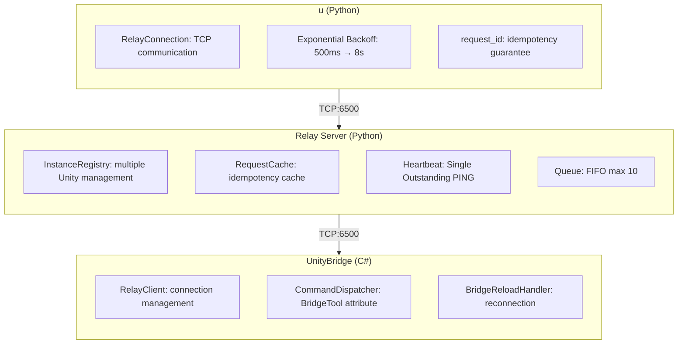

# Unity CLI

[](https://github.com/bigdra50/unity-cli/actions/workflows/ci.yml)
[](https://www.python.org/)
[](https://opensource.org/licenses/MIT)
[](https://unity.com/)
[](https://deepwiki.com/bigdra50/unity-cli)

[日本語版](README.jp.md)

A CLI tool for controlling Unity Editor from the command line.

## Overview

Execute Unity Editor operations from CLI: Play Mode control, console log retrieval, test execution, scene/GameObject manipulation, and more.

```bash
# Play Mode control
u play
u stop

# Get console logs (error and above)
u console get -l E

# Execute menu items
u menu exec "Assets/Refresh"

# Execute ContextMenu
u menu context "DoSomething" -t "/Player"
```

Key features:
- Execute Unity Editor operations from CLI
- Support for MenuItem / ContextMenu execution
- Simultaneous control of multiple Unity instances
- Domain reload resilience (auto-reconnection)
- Open projects with appropriate version (Unity Hub integration)
- Project information retrieval (no Relay Server required)

## Requirements

- [uv](https://docs.astral.sh/uv/) (Python package manager)
- Python 3.11+
- Unity 2021.3+
- Unity Hub (for `open`/`editor` commands)

## Quick Start

### 1. Unity Setup

Add the UnityBridge package to your Unity project:

```
Window > Package Manager > + > Add package from git URL...
https://github.com/bigdra50/unity-cli.git?path=UnityBridge
```

### 2. Connection

In Unity Editor, open `Window > Unity Bridge`:
1. Click Start Server (launches Relay Server)
2. Click Connect (Unity → Relay connection)

### 3. CLI Operations

```bash
# Run directly with uvx (no installation required)
uvx --from git+https://github.com/bigdra50/unity-cli u state

# Play Mode control
uvx --from git+https://github.com/bigdra50/unity-cli u play
uvx --from git+https://github.com/bigdra50/unity-cli u stop

# Get console logs (error and above)
uvx --from git+https://github.com/bigdra50/unity-cli u console get -l E
```

## Installation

```bash
# Global installation
uv tool install git+https://github.com/bigdra50/unity-cli

# With interactive UI (editor selection prompt)
uv tool install "git+https://github.com/bigdra50/unity-cli[interactive]"

# CLI commands (all aliases work the same)
unity-cli state    # Full name
unity state        # Short alias
u state            # Shortest alias

u play
u console get -l E -c 10       # Last 10 error+ logs

# Run Relay Server standalone
unity-relay --port 6500
```

## CLI Commands

### Version

```bash
u version                     # Show CLI version
```

### Shell Completion

```bash
# Zsh
u completion -s zsh > ~/.zsh/completions/_unity-cli

# Bash
u completion -s bash >> ~/.bashrc

# Fish
u completion -s fish > ~/.config/fish/completions/unity-cli.fish
```

### Open Project

```bash
# Open project with appropriate version (reads ProjectVersion.txt)
u open ./MyUnityProject

# Specify editor version
u open ./MyUnityProject --editor 2022.3.10f1

# Non-interactive mode (for CI/scripts)
u open ./MyUnityProject --non-interactive

# Wait until exit
u open ./MyUnityProject --wait
```

### Editor Management

```bash
# List installed editors
u editor list

# Install editor
u editor install 2022.3.10f1

# Install with modules
u editor install 2022.3.10f1 --modules android ios webgl
```

### Project Information (No Relay Server Required)

```bash
# Full project info
u project info ./MyUnityProject

# Unity version only
u project version ./MyUnityProject

# Package list
u project packages ./MyUnityProject

# Tags & layers
u project tags ./MyUnityProject

# Quality settings
u project quality ./MyUnityProject

# Assembly Definition list
u project assemblies ./MyUnityProject

# JSON output
u --json project info ./MyUnityProject
```

### Basic Operations (via Relay Server)

```bash
# Check editor state
u state

# Play Mode control
u play
u stop
u pause

# Console logs
u console get                  # All logs (plain text)
u console get -o json          # All logs (JSON format)
u console get -v               # All logs with stack traces
u console get -l W             # Warning and above (warning, error, exception)
u console get -l E             # Error and above (error, exception)
u console get -l +W            # Warning only
u console get -l +E+X          # Error and exception only
u console get -c 20            # Last 20 entries
u console get -f "error"       # Filter by text
u console clear                # Clear console

# Asset refresh
u refresh

# Editor selection
u selection

# Screenshot
u screenshot                           # GameView (default)
u screenshot -s scene                  # SceneView
u screenshot -s camera                 # Camera.Render
u screenshot -p ./output.png           # Custom path
u screenshot -s camera -c "Main Camera" -W 1920 -H 1080
```

### Instance Management

```bash
# List connected instances
u instances

# Specify target instance
u --instance /Users/dev/MyGame state
u --instance /Users/dev/Demo play
```

### Test Execution

```bash
# EditMode tests
u tests run edit

# PlayMode tests
u tests run play

# Filtering
u tests run edit --test-names "MyTests.SampleTest"
u tests run edit --categories "Unit" "Integration"
u tests run edit --assemblies "MyGame.Tests"

# List available tests
u tests list edit
u tests list play

# Check running test status
u tests status
```

### Scene Operations

```bash
# Active scene info
u scene active

# Hierarchy
u scene hierarchy                    # Root only (depth 1)
u scene hierarchy --depth 2          # Up to 2 levels
u scene hierarchy --page-size 100    # Custom page size

# Scene operations
u scene load --name MainScene
u scene save
```

### GameObject Operations

```bash
# Find
u gameobject find "Main Camera"
u gameobject find "Player" --iterate-all

# Create
u gameobject create --name "MyCube" --primitive Cube --position 0 1 0

# Modify
u gameobject modify --name "MyCube" --position 5 0 0 --rotation 0 45 0

# Delete
u gameobject delete --name "MyCube"
```

### Component Operations

```bash
# List components
u component list -t "Main Camera"

# Inspect component
u component inspect -t "Main Camera" -T Camera

# Add component
u component add -t "Player" -T Rigidbody

# Remove component
u component remove -t "Player" -T Rigidbody
```

### Menu / ContextMenu

```bash
# Execute menu
u menu exec "Edit/Play"
u menu exec "Assets/Refresh"
u menu exec "Window/General/Console"

# List menus
u menu list                    # All menus
u menu list -f "Assets"        # Filter
u menu list -f "Play" -l 20    # Limit count

# Execute ContextMenu (scene objects)
u menu context "Reset" -t "/Player"

# Execute ContextMenu (ScriptableObject)
u menu context "DoSomething" -t "Assets/Data/Config.asset"

# Execute ContextMenu (Prefab)
u menu context "Initialize" -t "Assets/Prefabs/Enemy.prefab"
```

### Asset Operations

```bash
# Create Prefab
u asset prefab -s "Player" -p "Assets/Prefabs/Player.prefab"

# Create ScriptableObject
u asset scriptable-object -T "GameConfig" -p "Assets/Data/Config.asset"

# Asset info
u asset info "Assets/Data/Config.asset"
```

### Configuration

```bash
# Show current configuration
u config show

# Generate default .unity-cli.toml
u config init
u config init -o ./custom-config.toml
u config init --force                  # Overwrite existing
```

## Options

### Common Options

| Option | Description | Default |
|--------|-------------|---------|
| `--relay-host` | Relay Server host | 127.0.0.1 |
| `--relay-port` | Relay Server port | 6500 |
| `--instance`, `-i` | Target Unity instance | default |
| `--timeout`, `-t` | Timeout (seconds) | 10.0 |
| `--json`, `-j` | Output JSON format | false |

### Tests Options

| Option | Description |
|--------|-------------|
| `--test-names`, `-n` | Test names (exact match) |
| `--group-pattern`, `-g` | Regex pattern for test names |
| `--categories`, `-c` | NUnit categories |
| `--assemblies`, `-a` | Assembly names |
| `--sync`, `-s` | Run synchronously (EditMode only) |

### Scene Hierarchy Options

| Option | Description | Default |
|--------|-------------|---------|
| `--depth`, `-d` | Hierarchy depth | 1 (root only) |
| `--page-size` | Page size | 50 |
| `--cursor` | Pagination cursor | 0 |

## Architecture



## Protocol Specification

See [docs/protocol-spec.md](docs/protocol-spec.md) for details.

- Framing: 4-byte big-endian length + JSON
- State Machine: DISCONNECTED → READY → BUSY → RELOADING
- Heartbeat: 5s interval, 15s timeout (3 retries)
- Retry: Exponential Backoff (500ms → 8s, max 30s)

## Troubleshooting

```bash
# Check if Relay Server is running
lsof -i :6500

# Check connected instances
u instances

# Check Unity console for errors
u console get -l E
```

## v2.x → v3.0 Migration

| Change | v2.x | v3.0 |
|--------|------|------|
| Command name | `unity-mcp` | `unity-cli` |
| Connection target | Unity direct (6400) | Relay Server (6500) |
| Protocol | 8-byte framing | 4-byte framing |
| Multiple instances | Not supported | Supported |

```bash
# v2.x
unity-mcp --port 6400 state

# v3.0
u state  # Via Relay
u --instance /path/to/project state  # Specific instance
```

## License

MIT License
