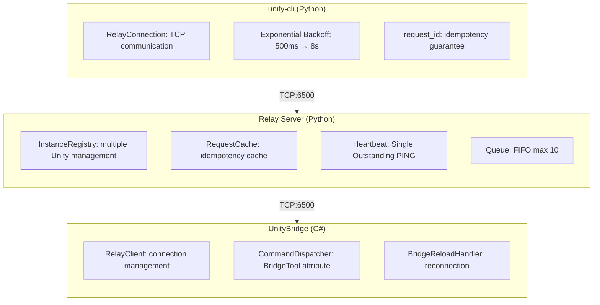

# Unity CLI

[](https://github.com/bigdra50/unity-cli/actions/workflows/ci.yml)
[](https://www.python.org/)
[](https://opensource.org/licenses/MIT)
[](https://unity.com/)

[日本語版](README.jp.md)

A CLI tool for controlling Unity Editor from the command line.

## Overview

Execute Unity Editor operations from CLI: Play Mode control, console log retrieval, test execution, scene/GameObject manipulation, and more.

```bash
# Play Mode control
unity-cli play
unity-cli stop

# Get console logs
unity-cli console get --types error

# Execute menu items
unity-cli menu exec "Assets/Refresh"

# Execute ContextMenu
unity-cli menu context "DoSomething" -t "/Player"
```

Key features:
- Execute Unity Editor operations from CLI
- Support for MenuItem / ContextMenu execution
- Simultaneous control of multiple Unity instances
- Domain reload resilience (auto-reconnection)
- Open projects with appropriate version (Unity Hub integration)
- Project information retrieval (no Relay Server required)

## Requirements

- [uv](https://docs.astral.sh/uv/) (Python package manager)
- Python 3.11+
- Unity 2021.3+
- Unity Hub (for `open`/`editor` commands)

## Quick Start

### 1. Unity Setup

Add the UnityBridge package to your Unity project:

```
Window > Package Manager > + > Add package from git URL...
https://github.com/bigdra50/unity-cli.git?path=UnityBridge
```

### 2. Connection

In Unity Editor, open `Window > Unity Bridge`:
1. Click Start Server (launches Relay Server)
2. Click Connect (Unity → Relay connection)

### 3. CLI Operations

```bash
# Run directly with uvx (no installation required)
uvx --from git+https://github.com/bigdra50/unity-cli unity-cli state

# Play Mode control
uvx --from git+https://github.com/bigdra50/unity-cli unity-cli play
uvx --from git+https://github.com/bigdra50/unity-cli unity-cli stop

# Get console logs
uvx --from git+https://github.com/bigdra50/unity-cli unity-cli console --types error
```

## Installation

```bash
# Global installation
uv tool install git+https://github.com/bigdra50/unity-cli

# With interactive UI (editor selection prompt)
uv tool install "git+https://github.com/bigdra50/unity-cli[interactive]"

# CLI commands
unity-cli state
unity-cli play
unity-cli console --types error --count 10

# Run Relay Server standalone
unity-relay --port 6500
```

## Shell Completion

Enable tab completion for your shell:

```bash
# Bash
unity-cli completion bash >> ~/.bashrc

# Zsh
unity-cli completion zsh >> ~/.zshrc

# Fish
unity-cli completion fish > ~/.config/fish/completions/unity-cli.fish

# PowerShell
unity-cli completion powershell >> $PROFILE
```

Restart your shell or source the config file to enable completion.

## CLI Commands

### Open Project

```bash
# Open project with appropriate version (reads ProjectVersion.txt)
unity-cli open ./MyUnityProject

# Specify editor version
unity-cli open ./MyUnityProject --editor 2022.3.10f1

# Non-interactive mode (for CI/scripts)
unity-cli open ./MyUnityProject --non-interactive

# Wait until exit
unity-cli open ./MyUnityProject --wait
```

### Editor Management

```bash
# List installed editors
unity-cli editor list

# Install editor
unity-cli editor install 2022.3.10f1

# Install with modules
unity-cli editor install 2022.3.10f1 --modules android ios webgl
```

### Project Information (No Relay Server Required)

```bash
# Full project info
unity-cli project info ./MyUnityProject

# Unity version only
unity-cli project version ./MyUnityProject

# Package list
unity-cli project packages ./MyUnityProject

# Tags & layers
unity-cli project tags ./MyUnityProject

# Quality settings
unity-cli project quality ./MyUnityProject

# Assembly Definition list
unity-cli project assemblies ./MyUnityProject

# JSON output
unity-cli --json project info ./MyUnityProject
```

### Basic Operations (via Relay Server)

```bash
# Check editor state
unity-cli state

# Play Mode control
unity-cli play
unity-cli stop
unity-cli pause

# Console logs
unity-cli console
unity-cli console --types error warning --count 20

# Asset refresh
unity-cli refresh
```

### Instance Management

```bash
# List connected instances
unity-cli instances

# Specify target instance
unity-cli --instance /Users/dev/MyGame state
unity-cli --instance /Users/dev/Demo play

# Change default instance
unity-cli set-default /Users/dev/MyGame
```

### Test Execution

```bash
# EditMode tests
unity-cli tests edit

# PlayMode tests
unity-cli tests play

# Filtering
unity-cli tests edit --test-names "MyTests.SampleTest"
unity-cli tests edit --category-names "Unit" "Integration"
unity-cli tests edit --assembly-names "MyGame.Tests"
```

### Scene Operations

```bash
# Active scene info
unity-cli scene active

# Hierarchy
unity-cli scene hierarchy                    # Root only
unity-cli scene hierarchy --depth 2          # Up to 2 levels
unity-cli scene hierarchy --iterate-all      # All levels (paging)

# Scene operations
unity-cli scene load --name MainScene
unity-cli scene save
unity-cli scene create --name NewScene --path Assets/Scenes
```

### GameObject Operations

```bash
# Find
unity-cli gameobject find "Main Camera"
unity-cli gameobject find "Player" --iterate-all

# Create
unity-cli gameobject create --name "MyCube" --primitive Cube --position 0,1,0

# Modify
unity-cli gameobject modify --name "MyCube" --position 5,0,0 --rotation 0,45,0

# Delete
unity-cli gameobject delete --name "MyCube"
```

### Component Operations

```bash
# List components
unity-cli component list -t "Main Camera"

# Inspect component
unity-cli component inspect -t "Main Camera" -T Camera

# Add component
unity-cli component add -t "Player" -T Rigidbody

# Remove component
unity-cli component remove -t "Player" -T Rigidbody
```

### Menu / ContextMenu

```bash
# Execute menu
unity-cli menu exec "Edit/Play"
unity-cli menu exec "Assets/Refresh"
unity-cli menu exec "Window/General/Console"

# List menus
unity-cli menu list                    # All menus
unity-cli menu list -f "Assets"        # Filter
unity-cli menu list -f "Play" -l 20    # Limit count

# Execute ContextMenu (scene objects)
unity-cli menu context "Reset" -t "/Player"

# Execute ContextMenu (ScriptableObject)
unity-cli menu context "DoSomething" -t "Assets/Data/Config.asset"

# Execute ContextMenu (Prefab)
unity-cli menu context "Initialize" -t "Assets/Prefabs/Enemy.prefab"
```

### Asset Operations

```bash
# Create Prefab
unity-cli asset prefab -s "Player" -p "Assets/Prefabs/Player.prefab"

# Create ScriptableObject
unity-cli asset scriptable-object -T "GameConfig" -p "Assets/Data/Config.asset"

# Asset info
unity-cli asset info "Assets/Data/Config.asset"
```

### Material Operations

```bash
unity-cli material info --path Assets/Materials/Default.mat
unity-cli material create --path Assets/Materials/New.mat --shader Standard
unity-cli material set-color --path Assets/Materials/New.mat --color 1,0,0,1
```

## Options

### Common Options

| Option | Description | Default |
|--------|-------------|---------|
| `--host` | Relay Server host | 127.0.0.1 |
| `--port` | Relay Server port | 6500 |
| `--instance` | Target Unity instance | default |
| `--timeout` | Timeout (ms) | 30000 |

### Tests Options

| Option | Description |
|--------|-------------|
| `--test-names` | Test names (exact match) |
| `--group-names` | Group names (regex) |
| `--category-names` | NUnit categories |
| `--assembly-names` | Assembly names |

### Scene Hierarchy Options

| Option | Description | Default |
|--------|-------------|---------|
| `--depth` | Hierarchy depth | 0 (root only) |
| `--iterate-all` | Auto-fetch all pages | false |
| `--page-size` | Page size | 50 |

## Architecture



## Protocol Specification

See [docs/protocol-spec.md](docs/protocol-spec.md) for details.

- Framing: 4-byte big-endian length + JSON
- State Machine: DISCONNECTED → READY → BUSY → RELOADING
- Heartbeat: 5s interval, 15s timeout (3 retries)
- Retry: Exponential Backoff (500ms → 8s, max 30s)

## Troubleshooting

```bash
# Check if Relay Server is running
lsof -i :6500

# Check connected instances
unity-cli instances

# Check Unity console for errors
unity-cli console --types error
```

## v2.x → v3.0 Migration

| Change | v2.x | v3.0 |
|--------|------|------|
| Command name | `unity-mcp` | `unity-cli` |
| Connection target | Unity direct (6400) | Relay Server (6500) |
| Protocol | 8-byte framing | 4-byte framing |
| Multiple instances | Not supported | Supported |

```bash
# v2.x
unity-mcp --port 6400 state

# v3.0
unity-cli state  # Via Relay
unity-cli --instance /path/to/project state  # Specific instance
```

## License

MIT License
